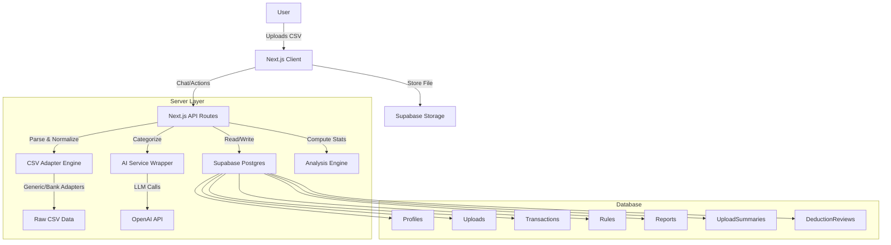

# Recovery and Refinement Plans (Historical)

This document contains a historical record of previous recovery and refinement plans for the Taxwise project.

---

# Taxwise — Technical Architecture (v3 - Analysis Added)

## 1. System Architecture



## 2. CSV Parsing Pipeline (The "Adapter" Pattern)

To handle the "Many Formats" requirement, we use an Adapter pattern.

### Interface `CsvAdapter`
- `match(filePreview: string): number` - Returns confidence (0-1).
- `mapColumns(headers: string[]): Mapping` - Maps CSV headers to internal schema.
- `parseRow(row: any, mapping: Mapping): NormalizedTransaction` - Converts row to standard format.

### Implementation Strategy
1.  **GenericAdapter**: Uses fuzzy matching on headers (Date, Description, Amount/Dr/Cr).
2.  **NigeriaBankAdapters**: Specific logic for GTB, Zenith, etc. (Added incrementally).
3.  **Fallback**: If no adapter matches > threshold, ask user in chat to map columns manually.

## 3. Database Schema (Updated)

```sql
-- Core User Profile
CREATE TABLE profiles (
    user_id UUID PRIMARY KEY REFERENCES auth.users,
    country_code TEXT DEFAULT 'NG',
    currency_code TEXT DEFAULT 'NGN',
    tax_year_start DATE,
    created_at TIMESTAMPTZ DEFAULT NOW()
);

-- Uploads Tracking
CREATE TABLE uploads (
    id UUID PRIMARY KEY DEFAULT gen_random_uuid(),
    user_id UUID REFERENCES profiles(user_id),
    file_url TEXT NOT NULL,
    filename TEXT NOT NULL,
    status TEXT CHECK (status IN ('processing', 'waiting_input', 'completed', 'failed')),
    parsing_profile JSONB, -- Stores adapter used, column mapping
    created_at TIMESTAMPTZ DEFAULT NOW()
);

-- Normalized Ledger
CREATE TABLE transactions (
    id UUID PRIMARY KEY DEFAULT gen_random_uuid(),
    user_id UUID REFERENCES profiles(user_id),
    upload_id UUID REFERENCES uploads(id),
    
    -- Normalized Fields
    date DATE NOT NULL,
    description TEXT NOT NULL,
    amount NUMERIC(12, 2) NOT NULL, -- Always positive
    type TEXT CHECK (type IN ('income', 'expense')), 
    currency TEXT DEFAULT 'NGN',
    
    -- Categorization & Tax
    category_id UUID REFERENCES categories(id),
    is_deductible BOOLEAN DEFAULT FALSE,
    deductible_confidence NUMERIC(3, 2), -- AI confidence
    
    -- Metadata
    raw_row JSONB, -- For debugging
    status TEXT DEFAULT 'pending_review' -- pending_review, approved
);

-- Categories
CREATE TABLE categories (
    id UUID PRIMARY KEY DEFAULT gen_random_uuid(),
    user_id UUID REFERENCES profiles(user_id), -- Null for system defaults
    name TEXT NOT NULL,
    type TEXT CHECK (type IN ('income', 'expense')),
    is_system_default BOOLEAN DEFAULT FALSE
);

-- Rules for Auto-Categorization
CREATE TABLE rules (
    id UUID PRIMARY KEY DEFAULT gen_random_uuid(),
    user_id UUID REFERENCES profiles(user_id),
    match_field TEXT, -- 'description', 'amount', etc.
    match_pattern TEXT, -- 'contains:Uber'
    action_category_id UUID REFERENCES categories(id),
    action_deductible BOOLEAN
);

-- AI Audit Log
CREATE TABLE ai_audit_logs (
    id UUID PRIMARY KEY DEFAULT gen_random_uuid(),
    user_id UUID REFERENCES profiles(user_id),
    action TEXT,
    input_payload JSONB,
    output_payload JSONB,
    model_version TEXT,
    created_at TIMESTAMPTZ DEFAULT NOW()
);

-- NEW: Upload Summaries (Pre-computed stats for dashboards)
CREATE TABLE upload_summaries (
    id UUID PRIMARY KEY DEFAULT gen_random_uuid(),
    upload_id UUID REFERENCES uploads(id) ON DELETE CASCADE,
    income_total NUMERIC(12, 2) DEFAULT 0,
    expense_total NUMERIC(12, 2) DEFAULT 0,
    net_total NUMERIC(12, 2) DEFAULT 0,
    by_category JSONB, -- { "Transport": { amount: 100, percent: 10 }, ... }
    by_month JSONB, -- { "2024-01": { income: 500, expense: 200 }, ... }
    top_merchants JSONB, -- [{ name: "Uber", amount: 500, count: 10 }, ...]
    largest_transactions JSONB, -- { income: [...], expense: [...] }
    uncategorized_count INTEGER DEFAULT 0,
    quality_flags JSONB, -- { duplicates: 2, multi_currency: false, ... }
    created_at TIMESTAMPTZ DEFAULT NOW()
);

-- NEW: Deduction Reviews (User decisions on specific items)
CREATE TABLE deduction_reviews (
    id UUID PRIMARY KEY DEFAULT gen_random_uuid(),
    transaction_id UUID REFERENCES transactions(id) ON DELETE CASCADE,
    user_decision TEXT CHECK (user_decision IN ('business', 'mixed', 'personal')),
    notes TEXT,
    created_at TIMESTAMPTZ DEFAULT NOW()
);
```

## 4. AI Integration (Server-Side)

### Responsibilities
- **Categorization**: Suggest category based on description + amount.
- **Deduction Detection**: "Is this likely a business expense?"
- **Summarization**: Generate "Next Steps" text based on ledger data.

### Constraints
- **Structured Output**: AI must return JSON (validated by Zod).
- **No Calculation**: AI does not sum numbers; DB does `SUM(amount)`.
- **No Legal Advice**: System prompt enforces "general info only" tone.

## 5. Country Packs

Modular configuration for localization.
- `src/lib/countries/ng/`:
    - `config.ts`: Currency 'NGN', Tax Year (Jan-Dec).
    - `categories.ts`: Default categories for Nigeria.
    - `disclaimers.ts`: Legal text.
    - `estimator.ts`: Basic tax bracket logic (optional/MVP).

## 6. API Routes
- `POST /api/chat`: Main entry point for chat interaction.
- `POST /api/upload`: Handle file upload & trigger processing.
- `POST /api/upload/confirm-mapping`: User confirms column mapping.
- `GET /api/reports/preview`: Get computed totals for current view.
- `POST /api/reports/generate`: Create PDF/CSV and return download URL.
- `GET /api/uploads/[id]/summary`: Get pre-computed analysis data.

---

# Taxwise — Product & Development Document (v3 - CSV-First Tax Chat + Analysis MVP)

## 1. Product Overview
Taxwise is a **CSV-first tax chat assistant** for freelancers, small business owners, and individuals (primarily in Nigeria). It simplifies tax compliance by turning messy bank statements into clean, categorized tax reports via an intelligent chat interface and interactive analysis dashboards.

**Core Promise:** "Upload your statement, chat with Taxwise, and get your tax report done."

**Target Users:**
- Freelancers/Creators with multiple income sources.
- Small Business Owners (SMBs) needing basic bookkeeping.
- Employees with side hustles.

## 2. Core User Experience (The Chat + Analysis Flow)
1.  **Sign Up/Login**: User enters the app.
2.  **Land on Chat**: The primary interface is a chat window.
3.  **Upload CSV**: User uploads bank statements, POS exports, or wallet exports.
4.  **System Parsing**:
    - Auto-detects columns.
    - Asks clarification questions if ambiguous.
5.  **Categorization & Analysis**:
    - Applies user rules.
    - Uses AI to categorize unknown transactions.
    - Flags probable tax deductions.
    - **NEW**: Generates an "Analysis Session" for the upload.
6.  **Interactive Session View**:
    - User clicks into the upload session to see insights, review deductibles, and check tax estimates.
7.  **Review Loop**: User reviews low-confidence items and confirms deductions via chat or the Deductibles view.
8.  **Report Generation**: System generates a **Tax Summary** (PDF) and **Accountant Pack** (Clean CSV).

## 3. Key Features (MVP)

### A. Chat Interface (Primary UI)
- **Message Types**: Text, CSV Uploads, System Cards ("Found 1,284 rows"), Action Buttons ("View Analysis", "Generate Report").
- **Conversation Stages**: Upload -> Parse -> Categorize -> Clarify -> Report.

### B. Upload Session & Analysis (New Pages)
Each CSV upload becomes a "Report Session" with specific views:
1.  **Overview**: Total Income/Expense, Net Cashflow, Probable Deductibles, "Needs Review" count.
2.  **Analysis**:
    - **Category Breakdown**: Pie/bar chart of expenses by category.
    - **Monthly Trend**: Income vs Expense per month.
    - **Top Merchants**: Frequency and total spend by merchant.
    - **Biggest Transactions**: Largest income and expense entries.
    - **Data Quality**: Flags for duplicates, uncategorized items, mapping confidence.
3.  **Deductibles View**:
    - Tabs: Likely Deductible, Possibly Deductible (Needs Review), Personal.
    - Toggles: "Business / Mixed / Personal".
    - Summary Cards: Potential savings estimate.
4.  **Tax Report Section** (Nigeria-first):
    - **Tax Summary**: Taxable income estimate, Estimated tax range (or exact if NG pack enabled).
    - **Action Plan**: "What to do now" checklist (e.g., "Separate business account").
5.  **Exports Hub**:
    - Download Final Tax Report (PDF).
    - Download Accountant Ledger (CSV).
    - Download Category Summary (CSV).

### C. Intelligent CSV Parsing (The Engine)
- **Multi-Format Support**: Handles various Nigerian bank formats (GTB, Access, Zenith, etc.) and generic CSVs.
- **Normalization**: Converts all inputs into a standard ledger: `Date | Description | Type | Amount | Currency`.
- **Heuristics**: Auto-detects headers. Falls back to asking the user if confidence is low.

### D. Categorization Engine (Hybrid)
1.  **Rules**: "If merchant contains 'Uber', category is 'Transport'".
2.  **AI Classification**: Suggests categories for unmapped rows with confidence scores and reasoning.
3.  **User Review**: Bulk approval flow for high-confidence matches.

### E. Tax & Deduction Logic (Safe & Localized)
- **Deduction Flags**: Flags common business expenses (Internet, Rent, Tools).
- **Qualification**: Asks safe questions ("Is this strictly for business?").
- **Tax Estimation**:
    - **MVP**: Estimated Range + Scenarios (e.g., "Likely between ₦X and ₦Y").
    - **Disclaimer**: "General information, not legal advice."
    - **Country Packs**: Nigeria-first logic for currency (NGN) and tax year.

## 4. Technical Specifications

### Data Model (Supabase / Postgres)
- **`profiles`**: User settings, country (default NG), currency.
- **`uploads`**: File metadata, status, parsing profile (mapping used).
- **`transactions`**: Normalized ledger linked to `upload_id`.
- **`categories`**: Default (Country-specific) + Custom.
- **`rules`**: Matching logic for auto-categorization.
- **`reports`**: Generated PDF/CSV links.
- **`ai_audit_logs`**: Log of all AI decisions/inputs for safety.
- **`parsing_issues`**: Log of rows that failed parsing.
- **`upload_summaries`** (NEW): Pre-computed stats for the dashboard (income_total, by_category, by_month, etc.).
- **`deduction_reviews`** (NEW): User decisions on deductibility (business|mixed|personal).

### Tech Stack
- **Frontend**: Next.js (App Router), Tailwind CSS, Shadcn/UI, Recharts (for analysis charts).
- **Backend**: Supabase (Auth, Postgres, Storage).
- **AI**: Server-side wrapper (OpenAI), Schema-validated (Zod).
- **Processing**: Next.js Route Handlers (MVP) or Supabase Edge Functions.

### Architecture Patterns
- **CSV Adapters**: Interface for `GenericAdapter` vs `BankSpecificAdapter`.
- **Country Packs**: Modular config for generic logic (Currency, Defaults, Disclaimers).
- **Session Analysis**: Compute heavy stats once after parsing/categorization and store in `upload_summaries`.

## 5. Security & Privacy
- **RLS (Row Level Security)**: Strict `user_id` isolation on all tables.
- **AI Guardrails**: AI never calculates tax rates directly; it only categorizes and summarizes DB data.
- **Disclaimer**: Always displayed on tax estimates.

## 6. Pricing Model
- **Free**: 1 Upload + Summary (No download).
- **Pay-per-report**: One-time fee for finalized report (Yearly users).
- **Pro Monthly**: Unlimited uploads + reports (Continuous users).

---

# Taxwise — Development Roadmap (MVP + Analysis)

## Phase 1: Foundation & Upload Pipeline (Weeks 1-2)
**Goal**: User can sign up, upload a CSV, and see parsed data.

### 1.1 Project Setup
- [ ] Initialize Next.js 14 (App Router) + Tailwind + Shadcn/UI.
- [ ] Setup Supabase project (Auth + Database + Storage).
- [ ] Implement RLS policies for all tables (including new summaries tables).

### 1.2 Chat UI Skeleton
- [ ] Create `ChatInterface` component.
- [ ] Implement file upload UI within chat.
- [ ] Handle file upload to Supabase Storage.

### 1.3 CSV Parsing Engine
- [ ] Build `CsvAdapter` interface.
- [ ] Implement `GenericAdapter` with fuzzy header matching.
- [ ] Create API route to parse CSV and store in `transactions` table.
- [ ] Handle "Ambiguous Columns" flow (Ask user to map columns).

## Phase 2: Categorization & Intelligence (Weeks 3-4)
**Goal**: Transactions are categorized automatically or via AI.

### 2.1 Rules Engine
- [ ] Implement basic string matching rules.
- [ ] specific "Nigeria Default" categories seed.

### 2.2 AI Integration
- [ ] Setup OpenAI API wrapper (Server-side).
- [ ] Build categorization prompt with Zod schema validation.
- [ ] Implement "Bulk Review" UI for AI suggestions.

### 2.3 Deduction Logic
- [ ] Add logic to flag "likely deductible" items.
- [ ] Implement chat flow for deduction clarification.

## Phase 3: Analysis & Reports (Weeks 5-6)
**Goal**: User sees interactive insights and gets value (Tax Estimate + PDF/CSV Download).

### 3.1 Analysis Engine
- [ ] Build `AnalysisService` to compute stats from transactions.
- [ ] Store results in `upload_summaries`.
- [ ] Build "Analysis Dashboard" UI (Charts, Tables).

### 3.2 Tax Engine (MVP)
- [ ] Implement `TaxEstimator` interface.
- [ ] Create `NigeriaBasicEstimator` (Range-based).
- [ ] Build "Tax Summary" card in chat.

### 3.3 Reporting
- [ ] Generate PDF Report (React-PDF or similar).
- [ ] Generate "Accountant Pack" CSV (Clean ledger).
- [ ] Add download actions to Chat and Exports page.

## Phase 4: Polish & Launch (Week 7)
- [ ] Landing page & Pricing/Billing integration.
- [ ] Mobile responsiveness check.
- [ ] Security audit (RLS, Input validation).
- [ ] Launch!

---

# Taxwise Development Roadmap: Path to MVP

## 1. Executive Summary
**Current Status**: Alpha Prototype.
- **Completed**: Core backend schema, Auth, CSV parsing, basic Uploads UI.
- **Missing/Mocked**: Main Dashboard (currently fake data), End-to-End Analysis Pipeline (sync timeout risks), Rules Management UI, Report Generation (PDF/CSV), and real-time data wiring.
- **Goal**: Transition from "Static Prototype" to "Functional MVP" suitable for Beta users in Nigeria.

---

## 2. Module Breakdown & Requirements

### Module A: Core Dashboard (The "Hub")
**Status**: ❌ Scaffolded (Mock Data Only)
- **Scope**: Connect the main dashboard view to real user data (`transactions`, `upload_summaries`).
- **Key Screens**: `/dashboard`
- **Requirements**:
  - Replace hardcoded "₦2,450,000" with `SUM(transactions.amount)` where `type='income'`.
  - Show real "Total Expenses" and "Deductible Expenses".
  - **Onboarding Element**: Implement the "Zero Data State" logic (see Section 4).
- **Acceptance Criteria**:
  - Dashboard shows `0` or `Empty State` for new users.
  - Dashboard updates immediately after a file is uploaded and analyzed.
  - Charts reflect actual category distribution.

### Module B: Analysis & Processing Engine
**Status**: ⚠️ Partial / Risky (Synchronous)
- **Scope**: Robustify the analysis pipeline to handle real-world CSVs without timing out.
- **Backend Needs**:
  - Move `AnalysisEngine.runAnalysis` logic to a background job or optimize chunks.
  - Populate `upload_summaries` table after processing.
- **Acceptance Criteria**:
  - Uploading a 500-row CSV does not error out (504 Gateway Timeout).
  - "Uncategorized" transactions are clearly flagged.
  - `upload_summaries` table is populated with correct pre-computed stats.

### Module C: Rules Engine UI
**Status**: ❌ Missing
- **Scope**: Interface for users to manage auto-categorization rules to save AI costs.
- **Key Screens**: `/dashboard/settings` (or new `/dashboard/rules`)
- **Requirements**:
  - List existing rules (Keyword -> Category).
  - "Create Rule" modal: "If description contains 'Uber', set category to 'Transport' and Deductible = 'Yes'".
  - "Apply Rules" button to re-run rules on existing pending transactions.
- **Acceptance Criteria**:
  - User can create a rule.
  - Next upload respects this rule (skips AI for matches).
  - User can delete/edit rules.

### Module D: Reports & Exports
**Status**: ⚠️ Partial (Client-side calculation)
- **Scope**: Generate professional artifacts for download.
- **Key Screens**: `/dashboard/reports`
- **Requirements**:
  - **PDF Generator**: Server-side generation (using `react-pdf` or similar) creating a branded summary.
  - **CSV Export**: Route to download filtered transactions as `.csv`.
  - **Logic**: Move tax estimation logic (Nigeria rules) to a shared utility/backend function.
- **Acceptance Criteria**:
  - "Download PDF" produces a file with correct totals and disclaimer.
  - "Export CSV" produces a clean file with columns: Date, Description, Amount, Category, Deductible Status.

### Module E: Settings & Billing Foundation
**Status**: ❌ Missing
- **Scope**: User profile management and "Billing-Ready" architecture.
- **Key Screens**: `/dashboard/settings`
- **Requirements**:
  - **Profile**: Update Name, Tax Year preference.
  - **Plan Structure**: Add `plan_tier` (free/pro) column to `profiles` table (default 'free').
  - **Gating Logic**: Create a `checkFeatureAccess(feature)` hook/utility (even if all return true for now).
- **Acceptance Criteria**:
  - User can update their profile.
  - DB schema supports `plan_tier` for future billing activation.

---

## 3. Execution Batches

### Batch 1: The "Real Data" Fix (High Priority)
*Focus: Connect existing UI to the database. No more fake numbers.*
1.  **Dashboard Wiring**: Fetch real sums from `transactions` table.
2.  **Upload Summaries**: Update `AnalysisEngine` to compute and save stats to `upload_summaries` table upon completion.
3.  **Empty States**: Implement the "Upload First" dashboard state.

### Batch 2: The "Processing Power" Upgrade
*Focus: Reliability and Rules.*
1.  **Async/Optimized Analysis**: Ensure `/api/analysis/run` handles batches robustly (e.g., reduce chunk size, simple client-side polling, or background job).
2.  **Rules UI**: Build the "Manage Rules" interface.
3.  **Rule Application**: Ensure `AnalysisEngine` applies user-defined rules before calling AI.

### Batch 3: The "Deliverable" (Exports)
*Focus: Value realization for the user.*
1.  **PDF Generation**: Implement tax summary PDF download.
2.  **CSV Export**: Implement clean transaction export.
3.  **Refinement**: Polish UI, tooltips, and "Beta" labels.

---

## 4. Dashboard Improvement: The "Empty State" Experience

**Recommendation: The "Active Empty State"**

Instead of a generic banner, the Dashboard should transform entirely when there is no data. It shouldn't look like a dashboard with "0" everywhere; it should look like an onboarding step.

**Proposed UX Pattern**:
If `total_transactions === 0`:
- **Hero Section**: "Welcome to Taxwise. Let's get your finances sorted."
- **Central Action Card**: Large, friendly dropzone/button: "Upload your first Bank Statement".
- **Value Props Below**: 3 simple icons: "We analyze your spending" -> "We find tax deductibles" -> "You get a ready-to-file report".
- **Demo Mode**: A small "Load Sample Data" link to let them see what a populated dashboard looks like (optional but high conversion).

**Why this is best**: It removes the "Cold Start" problem where a dashboard feels broken. It focuses 100% of the user's attention on the *one* action that matters: Uploading.

---

## 5. Compliance, Privacy & Legal (Nigeria-First)

### A. Required Legal Pages
*To be linked in Footer and Sign-up flows.*

1.  **Terms of Service (ToS)**
    - **Key Clause**: "Taxwise is a software tool, not a tax advisor."
    - **Liability**: Limitation of liability for tax penalties (user is responsible for final filing).
    - **Usage**: Acceptable use policy (no illegal transaction tracking).

2.  **Privacy Policy (NDPR Compliant)**
    - **Data Collection**: Explicitly state we collect financial transaction data.
    - **Purpose**: "To provide categorization and tax estimation services."
    - **Third Parties**: Disclosure of AI processing (OpenAI) – "Data is processed by AI partners but not used to train their public models" (Enterprise/Zero-retention APIs preferred).
    - **User Rights**: Right to request data deletion (GDPR/NDPR).

### B. Security & Architecture Commitments
1.  **Row Level Security (RLS)**: Already implemented. Ensures users can strictly access ONLY their own data.
2.  **Encryption**:
    - **At Rest**: PostgreSQL (Supabase) encryption.
    - **In Transit**: TLS 1.2+ for all API calls.
3.  **Data Minimization**:
    - We only store what is uploaded.
    - Allow users to "Delete Upload" which cascades and hard-deletes all associated transactions.
4.  **Audit Logs**:
    - `ai_audit_logs` table (already exists) tracks AI modifications.
    - Add `access_logs` for sensitive actions (exports, profile changes).

### C. User Consent Flow
1.  **Sign-Up Checkbox**: "I agree to the Terms & Privacy Policy."
2.  **Upload Consent**: Small text near Upload button: "By uploading, you allow Taxwise to process this data using automated analysis tools."

### D. Incident Response (Basic)
- **Plan**: If a data leak is suspected:
    1.  Rotate Supabase Service Role keys immediately.
    2.  Notify affected users within 72 hours (NDPR requirement).
    3.  Shut down the dashboard access temporarily.

---

## 6. Approval & Next Steps

This document serves as the master plan for the Beta release.

**Decision Required**:
- Do you approve this roadmap and the "Active Empty State" UX approach?
- Shall we begin with **Batch 1 (Real Data Wiring)**?

---

# Taxwise Dashboard Development Plan

## 1. Objective
Create the secure, private dashboard area where users interact with the core features of Taxwise (Chat, Analysis, Reports).

## 2. Architecture
The dashboard will use a **Layout Shell** pattern:
- **Route**: `/dashboard` (and sub-routes like `/dashboard/chat`, `/dashboard/analysis`).
- **Layout Component**: A persistent `Sidebar` and `Header` wrapper.
- **Authentication**: All dashboard routes will be protected via Supabase Middleware.

## 3. Structure & Components

### A. App Shell (`src/components/Layout/DashboardLayout.tsx`)
*   **Sidebar**: Navigation menu.
    *   *Items*: Dashboard (Home), Chat (Tax Assistant), Uploads (History), Settings.
*   **TopHeader**: User profile dropdown, Theme toggle, Mobile menu trigger.
*   **Main Content Area**: Dynamic slot for page content.

### B. Dashboard Home (`src/app/dashboard/page.tsx`)
*   **Welcome Section**: "Good morning, [User]".
*   **Quick Actions**: "Upload New CSV", "Resume Chat".
*   **Recent Activity**: List of recent uploads or analysis sessions.
*   **Summary Cards**: "Total Deductions Found", "Pending Reviews".

### C. Chat Interface (`src/app/dashboard/chat/page.tsx`)
*   **Based on**: Trezo `Apps/Chat` template.
*   **Modifications**:
    *   **Sidebar**: List of "Tax Sessions" (e.g., "Jan 2024 Statement", "Q1 Expenses") instead of Users.
    *   **Message Area**: Chat bubbles for User and AI.
    *   **Input Area**: Text input + **File Upload Button** (Critical for CSVs).
    *   **Context Panel**: (Optional) Side panel showing current analysis stats while chatting.

### D. Analysis View (`src/app/dashboard/analysis/[id]/page.tsx`)
*   **Purpose**: Visual breakdown of a specific uploaded CSV.
*   **Components**:
    *   **Category Breakdown**: Pie/Donut chart (Trezo Charts).
    *   **Transaction Table**: List of parsed transactions with "Deductible" toggle.
    *   **Monthly Trend**: Bar chart of income vs. expenses.

## 4. Implementation Steps (Phased)

**Phase 1: Shell & Home (Immediate)**
1.  Create `src/components/Layout/Sidebar.tsx` (Adapted from Trezo).
2.  Create `src/components/Layout/TopHeader.tsx`.
3.  Create `src/app/dashboard/layout.tsx` to wrap the private routes.
4.  Create `src/app/dashboard/page.tsx` (Empty placeholder with "Welcome").
    *   *Fixes the 404 error immediately.*

**Phase 2: Chat UI**
1.  Port `Apps/Chat` components to `src/components/Dashboard/Chat/`.
2.  Wire up the layout to the Chat page.

**Phase 3: Middleware & Protection**
1.  Ensure `middleware.ts` redirects unauthenticated users to `/auth/sign-in`.

## 5. Timeline
*   **Step 1 (Shell + Home)**: ~1 hour. (Will resolve the 404).
*   **Step 2 (Chat UI)**: ~2 hours.
*   **Step 3 (Middleware)**: ~30 mins.

---
**Approval Needed**: Does this structure align with your expectations?

---

# Plan: Expanding and Refining the Upload and Analysis Workflow

This document outlines the plan for enhancing the TaxWise application to support a more robust and user-friendly data upload and analysis process. This plan addresses PDF uploads, deferred analysis, handling of multiple accounts, and detection of internal transfers.

## 1. Feature Breakdown

### 1.1. PDF Upload and Parsing
- **Goal:** Allow users to upload PDF bank statements.
- **Implementation:** A multi-layered approach to parsing:
    1.  **Text-Based PDFs:** Use a library like `pdf-parse` to extract text. Develop a set of robust, bank-specific regex patterns to identify transaction tables and data points (Date, Description, Debits, Credits).
    2.  **Scanned/Image-Based PDFs (OCR):** Integrate a third-party OCR service (e.g., Google Cloud Vision, AWS Textract) or a self-hosted solution (Tesseract.js) to extract text from image-based PDFs. The extracted text will then be fed into the same regex-based parsing logic.
    3.  **AI-Powered Fallback:** For PDFs that cannot be parsed by rules, use a multimodal AI model (like GPT-4 with Vision) to "read" the PDF page and extract transactions in a structured JSON format. This is a more expensive fallback and should be used sparingly.
- **Normalization:** All extracted data, regardless of the source (CSV or PDF), will be normalized into a standard internal `Transaction` object format before being saved to the database.

### 1.2. Decoupled Upload and Analysis
- **Goal:** Separate the file upload process from the analysis process.
- **Implementation:**
    - Introduce a new concept called an **"Analysis Session"**.
    - When a user initiates an upload, a new `analysis_sessions` record is created with a `status` of `pending`.
    - Each uploaded file (and its associated data) is linked to this session.
    - The UI will display a list of uploaded files in the current session and provide two clear actions: **"Add More Files"** and **"Run Analysis"**.
    - The analysis engine will only be triggered when the user explicitly clicks "Run Analysis".

### 1.3. Multiple Account & Combined Analysis
- **Goal:** Allow users to upload and analyze statements from multiple bank accounts together.
- **Implementation:**
    - The "Analysis Session" model naturally supports this. Users can upload multiple files (CSV or PDF) from different banks into a single session.
    - A user-definable `account_name` field will be added to each upload, allowing users to label their uploads (e.g., "GTB Savings", "Zenith Current").
    - When "Run Analysis" is triggered, the system will process all transactions from all uploads within that session as a single, combined dataset.
    - The `upload_id` on each transaction will be retained, allowing for traceability back to the source file and account.

### 1.4. Internal Transfer Detection
- **Goal:** Identify and exclude transfers between a user's own accounts to prevent distortion of financial summaries.
- **Implementation:** A rule-based heuristic approach will be used post-analysis:
    1.  **Initial Flagging:** After all transactions for a session are categorized, a dedicated process will scan for potential internal transfers. It will look for pairs of transactions (one debit, one credit) across different user accounts that have:
        - Matching or very similar amounts.
        - Close transaction dates (e.g., within a 24-48 hour window).
        - Transaction descriptions containing keywords like "Transfer", "TRF", or the user's own name.
    2.  **User Confirmation (Optional but Recommended):** The system could present flagged transfers to the user for confirmation to improve accuracy.
    3.  **Exclusion from Analysis:** Transactions confirmed as internal transfers will be marked with an `is_internal_transfer` flag in the database and will be excluded from all financial calculations (total income, expenses, tax deductions).

## 2. Intended User Flow

1.  **Initiate Upload:** The user clicks "Upload Statement" from the dashboard.
2.  **Create Session:** The user is prompted to give the analysis session a name (e.g., "2024 Q1 Analysis," defaults to current date). A new session is created.
3.  **First Upload:** The user selects and uploads their first file (CSV or PDF). They can optionally assign a friendly name to the account (e.g., "My GTB Account").
4.  **File Processing & Validation:** The system processes the file, normalizes the data, and saves the transactions, linking them to the session. A summary of the upload (e.g., "Found 85 transactions in `statement_jan.pdf`") is displayed.
5.  **Review and Add More:** The UI shows the list of uploaded files for the current session. The user is presented with two primary actions:
    - **"Add Another File"**: Repeats the upload process for an additional statement.
    - **"Run Analysis"**: Proceeds to the next step.
6.  **Trigger Analysis:** Once all files are uploaded, the user clicks **"Run Analysis"**. The session status is updated to `analyzing`.
7.  **Combined Processing:** The backend gathers all transactions associated with the session.
8.  **Internal Transfer Detection:** The system runs the internal transfer detection logic on the combined dataset.
9.  **Categorization & Summarization:** The analysis engine categorizes all transactions and computes the final summaries.
10. **View Dashboard:** The user is redirected to the dashboard, which now displays the results of the combined analysis.

## 3. Data Model Implications

The following changes will be made to the Supabase schema:

- **`analysis_sessions` (New Table):**
    - `id` (uuid, pk)
    - `user_id` (uuid, fk to `users.id`)
    - `name` (text, user-defined name for the session)
    - `status` (enum: `pending`, `analyzing`, `completed`, `failed`)
    - `created_at` (timestamp)

- **`uploads` (Existing Table):**
    - Add `session_id` (uuid, fk to `analysis_sessions.id`)
    - Add `account_name` (text, nullable, user-defined)

- **`transactions` (Existing Table):**
    - Add `is_internal_transfer` (boolean, default `false`)

## 4. Edge Cases and Assumptions

- **Duplicate Files:** The system will check for and prevent the upload of the exact same file twice within a single session.
- **Overlapping Dates:** The system will assume that transactions are unique based on their content and will not perform date-based deduplication across files initially. The internal transfer logic will handle the most common case of this.
- **Abandoned Sessions:** Sessions left in a `pending` state for an extended period (e.g., >7 days) may be automatically cleaned up by a scheduled job.
- **Analysis Failures:** If the analysis process fails, the session status will be set to `failed`, and the user will be notified with a clear error message.
- **PDF Quality:** The plan assumes that for non-AI parsing, PDFs are text-based and reasonably well-formatted. Poorly scanned or malformed PDFs will likely fail parsing and will be flagged to the user.

## 5. Risks and Open Questions

- **PDF Parsing Complexity:** PDF parsing is notoriously difficult. The reliability of regexes across different banks and statement formats is a significant risk. The cost and performance of OCR and AI-based solutions also need to be carefully evaluated.
- **Internal Transfer Accuracy:** The heuristic for detecting internal transfers may produce false positives or miss valid transfers. A user confirmation step is highly recommended to mitigate this but adds complexity to the UI.
- **Scalability:** The analysis of very large sessions (many files, hundreds of thousands of transactions) could be slow or memory-intensive. The analysis process should be designed as a background job that can run asynchronously.

## 6. Phased Implementation Steps

1.  **Phase 1: Session Management & UI**
    - Implement the `analysis_sessions` table and update the `uploads` and `transactions` tables.
    - Build the new UI for creating sessions, uploading multiple files, and deferring analysis.
    - Modify the backend to link uploads to sessions.

2.  **Phase 2: Decoupled Analysis**
    - Implement the "Run Analysis" button logic.
    - Convert the analysis engine into an asynchronous background job that operates on a `session_id`.

3.  **Phase 3: Robust PDF Parsing**
    - Implement the text-based PDF parsing with `pdf-parse` and a library of regexes for 2-3 major Nigerian banks.
    - Add robust error handling to flag PDFs that fail to parse.

4.  **Phase 4: Internal Transfer Detection**
    - Implement the backend logic to detect and flag internal transfers within a completed analysis session.
    - Update the dashboard and reporting logic to exclude these transfers from financial calculations.

5.  **Phase 5 (Post-Beta): Advanced Parsing**
    - Evaluate and integrate an OCR/AI solution for handling scanned PDFs and complex formats based on user feedback and business priority.

---

# Phase 2: Core Workflow Recovery & Refinement Plan

## 1. Scope Summary

This phase resets and focuses our efforts on stabilizing the core user workflow. The primary objective is to make the journey from bank statement upload to tax report generation robust, reliable, and user-friendly. We will fix critical bugs, implement a crucial "Bank Accounts" feature, and redesign the upload process.

**Core Workflow:** `Sign In -> Dashboard -> Upload Statements (CSV/PDF) -> Run Analysis -> View Analysis/Deductions/Report`

---

## 2. Tasks & Implementation Steps

### **Step 1: Critical Bug Fix - PDF Parsing**

**Goal:** Resolve the `__TURBOPACK__...default is not a function` error and enable reliable PDF bank statement parsing, focusing on Nigerian bank formats.

*   **Task 1.1: Analyze and Fix the Root Cause**
    *   **Problem Analysis:** The error indicates a module resolution issue between Next.js's Turbopack bundler and the `pdf-parse` library. `pdf-parse` is likely a CommonJS module, and Turbopack's ESM-first approach is failing to correctly identify the main export function. The `(pdf as any).default(buffer)` syntax I attempted was a workaround for this, but it is not stable.
    *   **Proposed Fix:** Instead of fighting the bundler, we will force this specific part of the code to run in a pure Node.js environment where module resolution is more predictable. We will ensure the `upload/route.ts` API route is explicitly configured for the Node.js runtime.
    *   **Acceptance Criteria:**
        *   The `__TURBOPACK__` error is completely eliminated.
        *   PDF files can be uploaded and their text content is successfully extracted on the server without errors.

*   **Task 1.2: Implement Safe, Nigeria-First PDF Parsing**
    *   **Implementation:** The `PdfParserService` will be enhanced. After extracting text, it will use a series of pattern-matching tests to identify the specific Nigerian bank format (e.g., GTBank, Access Bank, etc.). A dedicated parser for the identified bank will then be used to extract transactions with high accuracy.
    *   **Fallback Behavior:** If a bank format is not recognized, the system will use a "generic" regex-based parser that attempts to find transactions based on common date and amount patterns.
    *   **User Feedback:** If the generic parser also fails or extracts zero transactions, the user will be shown a clear error message: "Could not extract any transactions from this PDF. Please ensure it is a text-based digital statement, not a scanned image."
    *   **Acceptance Criteria:**
        *   The system correctly identifies and parses at least two major Nigerian bank PDF statement formats.
        *   Unrecognized PDFs are handled gracefully by the generic parser.
        *   Users receive clear feedback when a PDF is un-parseable.

### **Step 2: Database Schema - Bank Accounts**

**Goal:** Create the necessary database structure to associate uploads with specific user-created bank accounts.

*   **Task 2.1: Create `bank_accounts` Table**
    *   **Implementation:** A new migration file will be created to define the `bank_accounts` table.
    *   **Schema:**
        *   `id` (UUID, Primary Key)
        *   `user_id` (UUID, Foreign Key to `auth.users`)
        *   `bank_name` (TEXT)
        *   `account_name` (TEXT, User-defined label, e.g., "My Business Account")
        *   `account_number` (TEXT, optional)
        *   `created_at`, `updated_at` (TIMESTAMPTZ)
    *   **RLS Policy:** A strict RLS policy will be added to ensure users can only access their own bank accounts.
    *   **Acceptance Criteria:**
        *   The migration is created and applied successfully.
        *   RLS policy is active and verified.

*   **Task 2.2: Update `uploads` Table**
    *   **Implementation:** A new migration will add a foreign key column `account_id` to the `uploads` table, linking it to the `bank_accounts` table.
    *   **Acceptance Criteria:**
        *   The `uploads` table is successfully altered to include the `account_id`.

### **Step 3: UI/UX - Upload Page Redesign & Functionality**

**Goal:** Create a functional, intuitive, multi-file upload experience that incorporates the new Bank Accounts feature.

*   **Task 3.1: Redesign Upload Page UI**
    *   **Implementation:** The current upload page will be replaced with a new design. It will feature a clean, step-by-step process.
    *   **Step 1: Select Bank Account:** A dropdown will allow the user to select an existing bank account. An "Add New Account" button will open a modal to create one.
    *   **Step 2: Upload Files:** A file dropzone will allow the user to drag-and-drop or select multiple CSV and PDF files.
    *   **Step 3: Run Analysis:** A prominent "Run Analysis" button will be the final action to start the backend processing. This button will be disabled until at least one file is added.
    *   **Acceptance Criteria:**
        *   The new UI is implemented and replaces the old upload page.
        *   The flow is logical and guides the user through the process.

*   **Task 3.2: Implement Bank Account Management**
    *   **Implementation:** I will build the "Add New Account" modal and the logic to fetch and display the user's existing accounts in the dropdown.
    *   **Acceptance Criteria:**
        *   Users can successfully create a new bank account from the upload page.
        *   New accounts are immediately available for selection without a page refresh.

*   **Task 3.3: Implement Multi-File Upload Logic**
    *   **Implementation:** The frontend will be updated to handle an array of files. The backend `upload` API route will be modified to accept and process multiple files in a single request, associating all of them with the selected `account_id` and a single analysis session.
    *   **Acceptance Criteria:**
        *   A user can upload 3 files (e.g., 2 PDFs, 1 CSV) in one go.
        *   All uploaded files are linked to the same analysis run.

### **Step 4: CSV Import Robustness**

**Goal:** Improve the reliability of CSV parsing to handle various bank formats and prevent duplicate data.

*   **Task 4.1: Enhance Column Mapping and Validation**
    *   **Implementation:** After a CSV is uploaded, instead of immediate processing, the system will display a preview of the data and a more robust column mapping interface. The user will be required to confirm the mapping for `Date`, `Description`, `Amount` (or `Debit`/`Credit`).
    *   **Acceptance Criteria:**
        *   The CSV import process includes a mandatory mapping/preview step.
        *   The system prevents import if required columns are not mapped.

*   **Task 4.2: Implement Deduplication**
    *   **Implementation:** A deterministic fingerprint (a hash of `date`, `amount`, and a cleaned `description`) will be generated for each transaction *before* insertion. The system will query for existing fingerprints and skip any duplicates found.
    *   **Acceptance Criteria:**
        *   Uploading the same CSV file twice does not create duplicate transaction entries in the database.

---

### **Step 5: Analysis & Data Integrity**

**Goal:** Ensure the analysis process is accurate and provides clear feedback to the user.

*   **Task 5.1: Implement Internal Transfer Detection**
    *   **Implementation:** After transactions are parsed, a heuristic-based process will run to identify potential transfers between a user's own accounts. It will look for pairs of transactions (debit and credit) with matching amounts and close transaction dates.
    *   **User Feedback:** Flagged transfers will be marked with an `is_internal_transfer` flag and will be excluded from all financial summaries (income, expenses) to avoid inflating totals.
    *   **Acceptance Criteria:**
        *   A transfer between two of the user's uploaded accounts is correctly identified and flagged.
        *   Flagged transfers do not appear in the main dashboard financial summaries.

*   **Task 5.2: Verify `upload_summaries` Population**
    *   **Implementation:** I will review the `AnalysisEngine` to ensure that upon successful completion, it correctly populates the `upload_summaries` table with the aggregated data (total income, expenses, etc.). This pre-computed data is essential for a performant dashboard.
    *   **Acceptance Criteria:**
        *   After a successful analysis run, a corresponding record exists in the `upload_summaries` table.

*   **Task 5.3: Improve Error Handling & User Feedback**
    *   **Implementation:** Review and improve all error messages related to the upload and analysis workflow. Messages must be actionable (e.g., "This CSV format is not recognized. Please ensure the columns are named 'Date', 'Description', and 'Amount'.")
    *   **Acceptance Criteria:**
        *   At least 5 distinct error scenarios (e.g., invalid file type, un-parseable PDF, failed CSV mapping) are handled with clear, user-friendly error messages.

---

## 4. Exclusions (What We Will NOT Do)

*   **No Transactions Page:** We will not build or expand a dedicated, editable "Transactions" page in this phase. The focus is on the aggregate analysis, not on individual transaction management.
*   **No Receipt Attachments:** The ability to upload and link receipts to transactions is deferred.
*   **No Advanced AI Rules:** The AI categorization will remain as-is. We will not build a user-facing rules engine in this phase.
*   **No Billing Integration:** All work related to monetization is out of scope.

---

## 4. Risks & Open Questions

*   **Risk: PDF Format Complexity:** Nigerian bank PDF statements are inconsistent. Some may be image-based (scanned), which will fail our text-extraction method.
    *   **Mitigation:** The user-facing error message is our primary mitigation. We will focus on the most common digital formats first.
*   **Risk: CSV Encoding Issues:** CSV files may come in different character encodings.
    *   **Mitigation:** We will default to `UTF-8` and add robust error handling to inform the user if the file cannot be read.
*   **Open Question:** How should we handle multi-currency transactions within a single statement?
    *   **Proposal for MVP:** For this phase, we will assume all transactions in a statement are in the bank account's primary currency (defaulting to NGN). Multi-currency support will be deferred.

---

## 5. Testing & Acceptance Checklist

*   **End-to-End Workflow:**
    *   [ ] A new user can sign up and is correctly guided through the onboarding banner.
    *   [ ] User creates a new Bank Account.
    *   [ ] User uploads one PDF and one CSV for that account in a single batch.
    *   [ ] User clicks "Run Analysis".
    *   [ ] The analysis completes successfully in the background.
    *   [ ] The Dashboard correctly reflects the summarized data from the uploads.
    *   [ ] The Deductions page correctly lists potential deductibles.
    *   [ ] The Reports page can generate a report for the analyzed period.
*   **PDF Parsing:**
    *   [ ] The `__TURBOPACK__` error is gone.
    *   [ ] Uploading a known-good GTBank PDF succeeds.
    *   [ ] Uploading a scanned (image-based) PDF fails with a clear error message.
*   **CSV Import:**
    *   [ ] Uploading a CSV prompts the user with a column-mapping UI.
    *   [ ] Uploading the same CSV twice does not create duplicate transactions.
*   **Security:**
    *   [ ] A user cannot see or select bank accounts belonging to another user.

---

# Phase 2: Recovery & Refinement Plan

## 1. Scope Summary

This plan focuses on stabilizing the core user workflow and addressing critical bugs to make the system reliable and functional. The primary goal is to ensure a user can sign in, upload a bank statement (CSV or PDF), run an analysis, and see the results.

**Core Workflow:**
`Sign In -> Dashboard -> Upload Statements (CSV/PDF) -> Run Analysis -> View Analysis/Deductions/Report`

This phase will prioritize bug fixes and essential features over new, complex functionality.

---

## 2. Tasks & Implementation Steps

### Task 2.1: Fix Critical PDF Parsing Error (High Priority)

**Problem:** The PDF import is failing with a `__TURBOPACK__...default is not a function` error. This is a blocker for a core feature.

**Analysis:**
*   **Root Cause:** The error stems from a module resolution conflict between Next.js's Turbopack bundler and the `pdf-parse` library. The library is likely a CommonJS module, and Turbopack is struggling to handle the `import` statement correctly in the Node.js runtime for API routes.
*   **Proposed Fix:** The most robust solution is to move the entire file upload and parsing logic out of the Next.js API route and into a Supabase Edge Function. Edge Functions run in a Deno environment, which has better support for diverse module types and is the recommended Supabase pattern for this kind of task. This also solves the authentication token expiration issue that was causing the `Unexpected token '<'` JSON error.

**Implementation Steps:**
1.  **Create Supabase Edge Function:**
    *   Create a new Edge Function named `upload-statement`.
    *   Move the file reading, parsing (both CSV and PDF), and database insertion logic from the old `/api/upload` route into this function.
    *   Ensure the function uses the `supabase-admin` client for all database operations to bypass RLS safely on the server.
    *   Add robust error handling and logging.
    *   Implement CORS headers to allow invocation from the browser.
2.  **Update Frontend to Use Edge Function:**
    *   Modify the upload component (`src/app/dashboard/uploads/create/page.tsx`) to call the `upload-statement` Edge Function using `supabase.functions.invoke()`.
    *   Remove the old `fetch` call to `/api/upload`.
3.  **Deploy and Verify:**
    *   Install the Supabase CLI.
    *   Deploy the `upload-statement` Edge Function.
    *   Create a test script to invoke the function directly and verify its functionality before integrating with the UI.

**Fallback Behavior:** If parsing fails within the Edge Function, it will return a specific error message (e.g., `{ error: 'Failed to parse PDF.' }`) which the frontend will display to the user. The original file will still be stored in Supabase Storage for manual inspection.

---

### Task 2.2: Implement Bank Accounts Feature

**Problem:** Uploads are not associated with a specific bank account, which is a mandatory requirement for organizing user data.

**Implementation Steps:**
1.  **Database Schema:**
    *   Create a new table `bank_accounts` with the following columns:
        *   `id` (uuid, primary key)
        *   `user_id` (uuid, foreign key to `auth.users`)
        *   `bank_name` (text, not null)
        *   `account_name` (text, not null, e.g., "Personal Savings")
        *   `account_number` (text)
        *   `created_at`, `updated_at`
    *   Enable RLS on this table, allowing users to only access their own accounts.
    *   Add a `bank_account_id` column to the `uploads` table.
2.  **UI on Upload Page:**
    *   In `src/app/dashboard/uploads/create/page.tsx`, add UI elements:
        *   A dropdown (`<select>`) to choose from existing bank accounts.
        *   A button to "Add New Bank Account," which opens a modal.
    *   The modal form will collect `Bank Name` and `Account Name`.
3.  **Frontend Logic:**
    *   Fetch the user's bank accounts to populate the dropdown.
    *   When a new bank account is created, insert it into the `bank_accounts` table and refresh the dropdown.
    *   When the "Run Analysis" button is clicked, the `bank_account_id` must be passed to the Edge Function along with the file.

---

### Task 2.3: Redesign and Functionalize Upload Page

**Problem:** The current upload page is basic and does not support the full, intended workflow.

**Implementation Steps:**
1.  **UI/UX Redesign:**
    *   Improve the layout for better visual appeal and clarity.
    *   Ensure the "Bank Accounts" feature is integrated seamlessly.
    *   The file upload area should clearly show a list of files staged for analysis. Users should be able to add/remove files from this list.
    *   The "Run Analysis" button should be the primary call-to-action.
2.  **Workflow Logic:**
    *   The page should not automatically trigger analysis on file selection.
    *   The "Run Analysis" button will trigger the `supabase.functions.invoke('upload-statement', ...)` call for each staged file.
    *   After the analysis is successfully completed, the user should be redirected to the main Dashboard, where they will see the updated analysis summary. The workflow of navigating to specific Analysis/Deductions/Report pages will be handled from the Dashboard itself.

---

### Task 2.4: Improve CSV Import Robustness

**Problem:** The current CSV parsing is likely brittle and will fail on different bank statement formats.

**Implementation Steps:**
1.  **Refactor CSV Parser:**
    *   Inside the new `upload-statement` Edge Function, enhance the CSV parsing logic.
    *   Instead of a fixed column order, implement a header-detection mechanism to find columns like "Date", "Description", "Debit", "Credit".
    *   Add more flexible date parsing to handle various formats (e.g., `dd/mm/yyyy`, `mm-dd-yy`).
2.  **Deduplication:**
    *   Before inserting transactions into the `transactions` table, generate a unique hash for each row (e.g., a combination of date, description, amount, and `bank_account_id`).
    *   Check if a transaction with that hash already exists for the user. If so, skip it.
    *   This will be handled within the `upload-statement` Edge Function.

---

## 3. Exclusions (What We Will NOT Do)

*   We will **not** build a separate, dedicated "Transactions" page in this phase.
*   We will **not** implement receipt attachments.
*   We will **not** expand the Rules Engine or AI Categorization beyond what is needed for basic parsing.
*   We will **not** add multi-currency support beyond the user's default currency.

---

## 4. Risks and Open Questions

*   **Risk:** The Supabase CLI might have installation or configuration issues in the development environment.
    *   **Mitigation:** Follow the official installation guide carefully and test the CLI with simple commands (`supabase login`, `supabase status`) before attempting to deploy functions.
*   **Risk:** Different PDF statement layouts will be complex to parse.
    *   **Mitigation:** For this phase, we will focus on a generic text-extraction approach. We will log parsing failures and the raw text to a separate table for future analysis and parser improvements.

---

## 5. Testing Checklist

-   [ ] **PDF Upload:** User can upload a PDF, and transactions are created successfully.
-   [ ] **CSV Upload:** User can upload a CSV, and transactions are created successfully.
-   [ ] **Bank Account Creation:** User can create a new bank account via the modal.
-   [ ] **Bank Account Selection:** Upload is correctly associated with the selected bank account.
-   [ ] **Error Handling:** A failed parse (for either PDF or CSV) displays a clear error message to the user.
-   [ ] **Deduplication:** Uploading the same file twice does not create duplicate transactions.
-   [ ] **Workflow:** After analysis, the user is redirected to the Dashboard and can see updated data.
-   [ ] **RLS:** A logged-in user cannot see or create bank accounts for another user.

---

## Taxwise System Refactor & Stabilization Plan

**Objective:** Address the critical issues identified in the audit report and bring the Taxwise system to a stable, production-ready state. This plan outlines a phased approach, prioritizing foundational stability, core feature implementation, and finally, monetization.

---

## Phase 1: Stabilize Core Functionality & Performance (Critical Priority)

**Goal:** Fix the most severe issues blocking the core user workflow and causing system instability.

### **Task 1.1: Isolate Parsing Logic into a Supabase Edge Function**

*   **Problem:** The current Next.js API route (`/api/upload`) has a fundamental conflict with the `pdf-parse` library, caused by the Next.js bundler (`Turbopack`). This completely blocks PDF uploads.
*   **Solution:** Move all file parsing logic to a dedicated Supabase Edge Function. This provides an isolated Deno environment, resolving the bundler conflict and making the parsing process more robust and scalable.
*   **Implementation Steps:**
    1.  Create a new Supabase Edge Function named `upload-statement`.
    2.  Migrate the complete parsing logic for both CSV and PDF files from the existing Next.js API route to the new Edge Function.
    3.  Adapt the code for the Deno runtime, ensuring all dependencies are Deno-compatible (using URL imports like `esm.sh`).
    4.  Refactor the frontend upload component (`src/app/dashboard/uploads/create/page.tsx`) to call this new Edge Function directly using `supabase.functions.invoke()`. This is more secure and handles authentication seamlessly.
    5.  Delete the old, problematic Next.js API route (`src/app/api/upload/route.ts`) and any related files.

### **Task 1.2: Refactor Dashboard to Use Pre-Computed Summaries**

*   **Problem:** The dashboard calculates all financial statistics on every page load by querying the entire `transactions` table. This is highly inefficient and will cause major performance degradation and timeouts as data volume grows.
*   **Solution:** The dashboard MUST be refactored to fetch its data from the `upload_summaries` table, which is designed to hold pre-computed totals.
*   **Implementation Steps:**
    1.  Modify the `AnalysisEngine` so that upon successful completion of a file analysis, it calculates all necessary summary statistics (total income, expenses, etc.) and populates the `upload_summaries` table.
    2.  Update all dashboard components to source their data exclusively from the `upload_summaries` table, filtered by the relevant `upload_id` or `user_id`.
    3.  Remove any direct, heavy queries from the dashboard components to the raw `transactions` table.

---

## Phase 2: Implement Missing Core Features

**Goal:** Build out the essential, user-facing features that are currently placeholders, completing the core value proposition of the product.

### **Task 2.1: Implement "Forgot Password" Functionality**

*   **Problem:** A standard and critical user account management feature is completely missing.
*   **Solution:** Implement the password reset flow using Supabase's built-in authentication methods.
*   **Implementation Steps:**
    1.  Create a new page at `/forgot-password`.
    2.  Add a form that allows a user to enter their email address.
    3.  Use the `supabase.auth.resetPasswordForEmail()` method to send a password reset link to the user.
    4.  Create a corresponding page at `/update-password` that handles the token from the email link and allows the user to set a new password.

### **Task 2.2: Build Out "Deductibles" and "Reports" Pages**

*   **Problem:** Two of the main product features are currently non-functional placeholder pages.
*   **Solution:** Implement the UI and backend logic for both pages.
*   **Implementation Steps:**
    1.  **Deductibles Page:**
        *   Create a UI to display a list of all transactions where the `deductible` flag is true.
        *   Allow users to filter this list by date range and category.
        *   Provide a summary of the total deductible amount.
    2.  **Reports Page:**
        *   Design a user interface that allows users to configure and generate reports.
        *   Implement the backend logic to generate a comprehensive financial report (in CSV or PDF format) based on the user's transaction data.
        *   Ensure reports include summaries of income, expenses, and deductible amounts.

---

## Phase 3: Enhance Data Integrity & User Experience

**Goal:** Improve the reliability of the data and make the application more intuitive and user-friendly.

### **Task 3.1: Implement Robust Transaction Deduplication**

*   **Problem:** The current system has an incomplete implementation for preventing duplicate transactions, which will lead to inaccurate financial analysis.
*   **Solution:** Finalize and enforce the transaction `fingerprint` logic.
*   **Implementation Steps:**
    1.  Refine the `fingerprint` generation algorithm to ensure it creates a reliable and unique identifier for each transaction (e.g., a hash of date, amount, merchant, and description).
    2.  Within the `upload-statement` Edge Function, before inserting new transactions, perform a query to fetch all existing fingerprints for that user.
    3.  Filter out any incoming transactions whose fingerprints already exist in the database, ensuring only new, unique transactions are inserted.

### **Task 3.2: Improve System-Wide Error Handling**

*   **Problem:** Error messages are generic and unhelpful, leading to a poor user experience.
*   **Solution:** Implement specific, actionable error feedback throughout the application.
*   **Implementation Steps:**
    1.  In the frontend, catch errors from the Edge Function and display user-friendly messages (e.g., "Invalid PDF format, please try a different file" instead of a generic "Upload failed").
    2.  Improve the UI to show clear loading states during analysis and empty states when no data is available.

---

## Phase 4: Prepare for Monetization

**Goal:** Implement the necessary infrastructure to support paid subscriptions.

### **Task 4.1: Implement Full Billing & Subscription Workflow**

*   **Problem:** The entire billing system is a non-functional placeholder.
*   **Solution:** Build out the complete subscription management flow using Paystack.
*   **Implementation Steps:**
    1.  Replace the mock checkout API with a real implementation that uses the Paystack API to create payment links or checkout sessions.
    2.  Implement a secure Paystack webhook (as a Supabase Edge Function) to listen for and handle subscription events (e.g., `subscription.create`, `invoice.payment_failed`).
    3.  Create a `subscriptions` table in the database to track each user's plan, status (active, canceled), and current billing period.
    4.  Implement application-level logic to restrict access to premium features based on the user's subscription status stored in the database.
