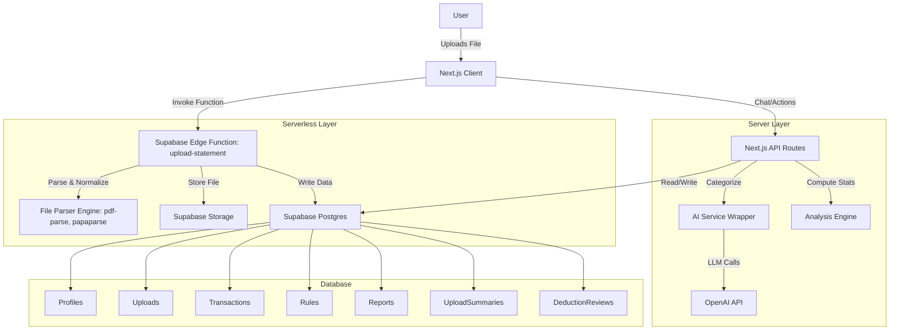

# Taxwise — Technical Architecture (v4 - Stabilized)

## 1. System Architecture



## 2. File Parsing Pipeline (Supabase Edge Function)

To resolve bundler conflicts and improve scalability, all file parsing is handled by a Supabase Edge Function `upload-statement`.

### Workflow
1.  **Client Invocation**: The frontend calls `supabase.functions.invoke('upload-statement')` with the file.
2.  **Deno Environment**: The Edge Function runs in a Deno environment.
3.  **Parsing**: It uses Deno-compatible libraries (`pdf-parse`, `papaparse`) to extract data.
4.  **Deduplication**: It generates a `fingerprint` for each transaction and checks for duplicates before insertion.
5.  **Database Insertion**: It inserts the new, unique transactions into the `transactions` table.

## 3. Database Schema

(No changes from v3, the schema remains the same)

```sql
-- Core User Profile
CREATE TABLE profiles (
    user_id UUID PRIMARY KEY REFERENCES auth.users,
    country_code TEXT DEFAULT 'NG',
    currency_code TEXT DEFAULT 'NGN',
    tax_year_start DATE,
    created_at TIMESTAMPTZ DEFAULT NOW()
);

-- Uploads Tracking
CREATE TABLE uploads (
    id UUID PRIMARY KEY DEFAULT gen_random_uuid(),
    user_id UUID REFERENCES profiles(user_id),
    file_url TEXT NOT NULL,
    filename TEXT NOT NULL,
    status TEXT CHECK (status IN ('processing', 'waiting_input', 'completed', 'failed')),
    parsing_profile JSONB, -- Stores adapter used, column mapping
    created_at TIMESTAMPTZ DEFAULT NOW()
);

-- Normalized Ledger
CREATE TABLE transactions (
    id UUID PRIMARY KEY DEFAULT gen_random_uuid(),
    user_id UUID REFERENCES profiles(user_id),
    upload_id UUID REFERENCES uploads(id),
    
    -- Normalized Fields
    date DATE NOT NULL,
    description TEXT NOT NULL,
    amount NUMERIC(12, 2) NOT NULL, -- Always positive
    type TEXT CHECK (type IN ('income', 'expense')), 
    currency TEXT DEFAULT 'NGN',
    
    -- Categorization & Tax
    category_id UUID REFERENCES categories(id),
    is_deductible BOOLEAN DEFAULT FALSE,
    deductible_confidence NUMERIC(3, 2), -- AI confidence
    
    -- Metadata
    raw_row JSONB, -- For debugging
    status TEXT DEFAULT 'pending_review' -- pending_review, approved
);

-- Categories
CREATE TABLE categories (
    id UUID PRIMARY KEY DEFAULT gen_random_uuid(),
    user_id UUID REFERENCES profiles(user_id), -- Null for system defaults
    name TEXT NOT NULL,
    type TEXT CHECK (type IN ('income', 'expense')),
    is_system_default BOOLEAN DEFAULT FALSE
);

-- Rules for Auto-Categorization
CREATE TABLE rules (
    id UUID PRIMARY KEY DEFAULT gen_random_uuid(),
    user_id UUID REFERENCES profiles(user_id),
    match_field TEXT, -- 'description', 'amount', etc.
    match_pattern TEXT, -- 'contains:Uber'
    action_category_id UUID REFERENCES categories(id),
    action_deductible BOOLEAN
);

-- AI Audit Log
CREATE TABLE ai_audit_logs (
    id UUID PRIMARY KEY DEFAULT gen_random_uuid(),
    user_id UUID REFERENCES profiles(user_id),
    action TEXT,
    input_payload JSONB,
    output_payload JSONB,
    model_version TEXT,
    created_at TIMESTAMPTZ DEFAULT NOW()
);

-- NEW: Upload Summaries (Pre-computed stats for dashboards)
CREATE TABLE upload_summaries (
    id UUID PRIMARY KEY DEFAULT gen_random_uuid(),
    upload_id UUID REFERENCES uploads(id) ON DELETE CASCADE,
    income_total NUMERIC(12, 2) DEFAULT 0,
    expense_total NUMERIC(12, 2) DEFAULT 0,
    net_total NUMERIC(12, 2) DEFAULT 0,
    by_category JSONB, -- { "Transport": { amount: 100, percent: 10 }, ... }
    by_month JSONB, -- { "2024-01": { income: 500, expense: 200 }, ... }
    top_merchants JSONB, -- [{ name: "Uber", amount: 500, count: 10 }, ...]
    largest_transactions JSONB, -- { income: [...], expense: [...] }
    uncategorized_count INTEGER DEFAULT 0,
    quality_flags JSONB, -- { duplicates: 2, multi_currency: false, ... }
    created_at TIMESTAMPTZ DEFAULT NOW()
);

-- NEW: Deduction Reviews (User decisions on specific items)
CREATE TABLE deduction_reviews (
    id UUID PRIMARY KEY DEFAULT gen_random_uuid(),
    transaction_id UUID REFERENCES transactions(id) ON DELETE CASCADE,
    user_decision TEXT CHECK (user_decision IN ('business', 'mixed', 'personal')),
    notes TEXT,
    created_at TIMESTAMPTZ DEFAULT NOW()
);
```

## 4. API Routes & Edge Functions

- **Edge Function: `upload-statement`**: Handles all file uploads, parsing, and insertion.
- `POST /api/chat`: Main entry point for chat interaction.
- `GET /api/reports/preview`: Get computed totals for current view.
- `POST /api/reports/generate`: Create PDF/CSV and return download URL.
- `GET /api/uploads/[id]/summary`: Get pre-computed analysis data from the `upload_summaries` table.