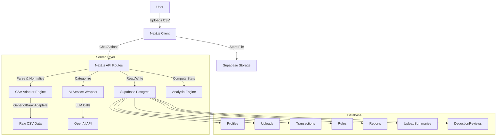

# Taxwise — Technical Architecture (v3 - Analysis Added)

## 1. System Architecture



## 2. CSV Parsing Pipeline (The "Adapter" Pattern)

To handle the "Many Formats" requirement, we use an Adapter pattern.

### Interface `CsvAdapter`
- `match(filePreview: string): number` - Returns confidence (0-1).
- `mapColumns(headers: string[]): Mapping` - Maps CSV headers to internal schema.
- `parseRow(row: any, mapping: Mapping): NormalizedTransaction` - Converts row to standard format.

### Implementation Strategy
1.  **GenericAdapter**: Uses fuzzy matching on headers (Date, Description, Amount/Dr/Cr).
2.  **NigeriaBankAdapters**: Specific logic for GTB, Zenith, etc. (Added incrementally).
3.  **Fallback**: If no adapter matches > threshold, ask user in chat to map columns manually.

## 3. Database Schema (Updated)

```sql
-- Core User Profile
CREATE TABLE profiles (
    user_id UUID PRIMARY KEY REFERENCES auth.users,
    country_code TEXT DEFAULT 'NG',
    currency_code TEXT DEFAULT 'NGN',
    tax_year_start DATE,
    created_at TIMESTAMPTZ DEFAULT NOW()
);

-- Uploads Tracking
CREATE TABLE uploads (
    id UUID PRIMARY KEY DEFAULT gen_random_uuid(),
    user_id UUID REFERENCES profiles(user_id),
    file_url TEXT NOT NULL,
    filename TEXT NOT NULL,
    status TEXT CHECK (status IN ('processing', 'waiting_input', 'completed', 'failed')),
    parsing_profile JSONB, -- Stores adapter used, column mapping
    created_at TIMESTAMPTZ DEFAULT NOW()
);

-- Normalized Ledger
CREATE TABLE transactions (
    id UUID PRIMARY KEY DEFAULT gen_random_uuid(),
    user_id UUID REFERENCES profiles(user_id),
    upload_id UUID REFERENCES uploads(id),
    
    -- Normalized Fields
    date DATE NOT NULL,
    description TEXT NOT NULL,
    amount NUMERIC(12, 2) NOT NULL, -- Always positive
    type TEXT CHECK (type IN ('income', 'expense')), 
    currency TEXT DEFAULT 'NGN',
    
    -- Categorization & Tax
    category_id UUID REFERENCES categories(id),
    is_deductible BOOLEAN DEFAULT FALSE,
    deductible_confidence NUMERIC(3, 2), -- AI confidence
    
    -- Metadata
    raw_row JSONB, -- For debugging
    status TEXT DEFAULT 'pending_review' -- pending_review, approved
);

-- Categories
CREATE TABLE categories (
    id UUID PRIMARY KEY DEFAULT gen_random_uuid(),
    user_id UUID REFERENCES profiles(user_id), -- Null for system defaults
    name TEXT NOT NULL,
    type TEXT CHECK (type IN ('income', 'expense')),
    is_system_default BOOLEAN DEFAULT FALSE
);

-- Rules for Auto-Categorization
CREATE TABLE rules (
    id UUID PRIMARY KEY DEFAULT gen_random_uuid(),
    user_id UUID REFERENCES profiles(user_id),
    match_field TEXT, -- 'description', 'amount', etc.
    match_pattern TEXT, -- 'contains:Uber'
    action_category_id UUID REFERENCES categories(id),
    action_deductible BOOLEAN
);

-- AI Audit Log
CREATE TABLE ai_audit_logs (
    id UUID PRIMARY KEY DEFAULT gen_random_uuid(),
    user_id UUID REFERENCES profiles(user_id),
    action TEXT,
    input_payload JSONB,
    output_payload JSONB,
    model_version TEXT,
    created_at TIMESTAMPTZ DEFAULT NOW()
);

-- NEW: Upload Summaries (Pre-computed stats for dashboards)
CREATE TABLE upload_summaries (
    id UUID PRIMARY KEY DEFAULT gen_random_uuid(),
    upload_id UUID REFERENCES uploads(id) ON DELETE CASCADE,
    income_total NUMERIC(12, 2) DEFAULT 0,
    expense_total NUMERIC(12, 2) DEFAULT 0,
    net_total NUMERIC(12, 2) DEFAULT 0,
    by_category JSONB, -- { "Transport": { amount: 100, percent: 10 }, ... }
    by_month JSONB, -- { "2024-01": { income: 500, expense: 200 }, ... }
    top_merchants JSONB, -- [{ name: "Uber", amount: 500, count: 10 }, ...]
    largest_transactions JSONB, -- { income: [...], expense: [...] }
    uncategorized_count INTEGER DEFAULT 0,
    quality_flags JSONB, -- { duplicates: 2, multi_currency: false, ... }
    created_at TIMESTAMPTZ DEFAULT NOW()
);

-- NEW: Deduction Reviews (User decisions on specific items)
CREATE TABLE deduction_reviews (
    id UUID PRIMARY KEY DEFAULT gen_random_uuid(),
    transaction_id UUID REFERENCES transactions(id) ON DELETE CASCADE,
    user_decision TEXT CHECK (user_decision IN ('business', 'mixed', 'personal')),
    notes TEXT,
    created_at TIMESTAMPTZ DEFAULT NOW()
);
```

## 4. AI Integration (Server-Side)

### Responsibilities
- **Categorization**: Suggest category based on description + amount.
- **Deduction Detection**: "Is this likely a business expense?"
- **Summarization**: Generate "Next Steps" text based on ledger data.

### Constraints
- **Structured Output**: AI must return JSON (validated by Zod).
- **No Calculation**: AI does not sum numbers; DB does `SUM(amount)`.
- **No Legal Advice**: System prompt enforces "general info only" tone.

## 5. Country Packs
Modular configuration for localization.
- `src/lib/countries/ng/`:
    - `config.ts`: Currency 'NGN', Tax Year (Jan-Dec).
    - `categories.ts`: Default categories for Nigeria.
    - `disclaimers.ts`: Legal text.
    - `estimator.ts`: Basic tax bracket logic (optional/MVP).

## 6. API Routes
- `POST /api/chat`: Main entry point for chat interaction.
- `POST /api/upload`: Handle file upload & trigger processing.
- `POST /api/upload/confirm-mapping`: User confirms column mapping.
- `GET /api/reports/preview`: Get computed totals for current view.
- `POST /api/reports/generate`: Create PDF/CSV and return download URL.
- `GET /api/uploads/[id]/summary`: Get pre-computed analysis data.
